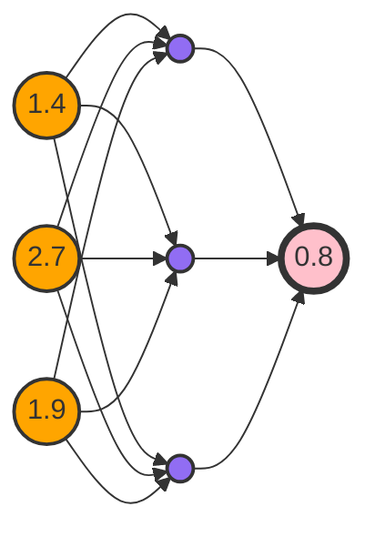
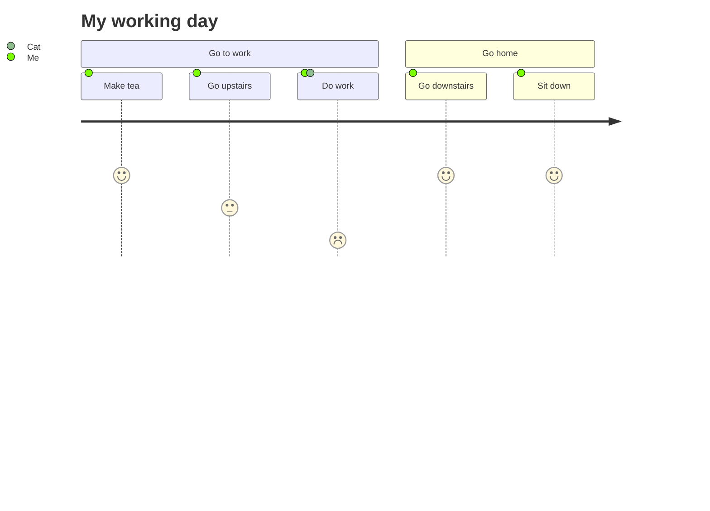
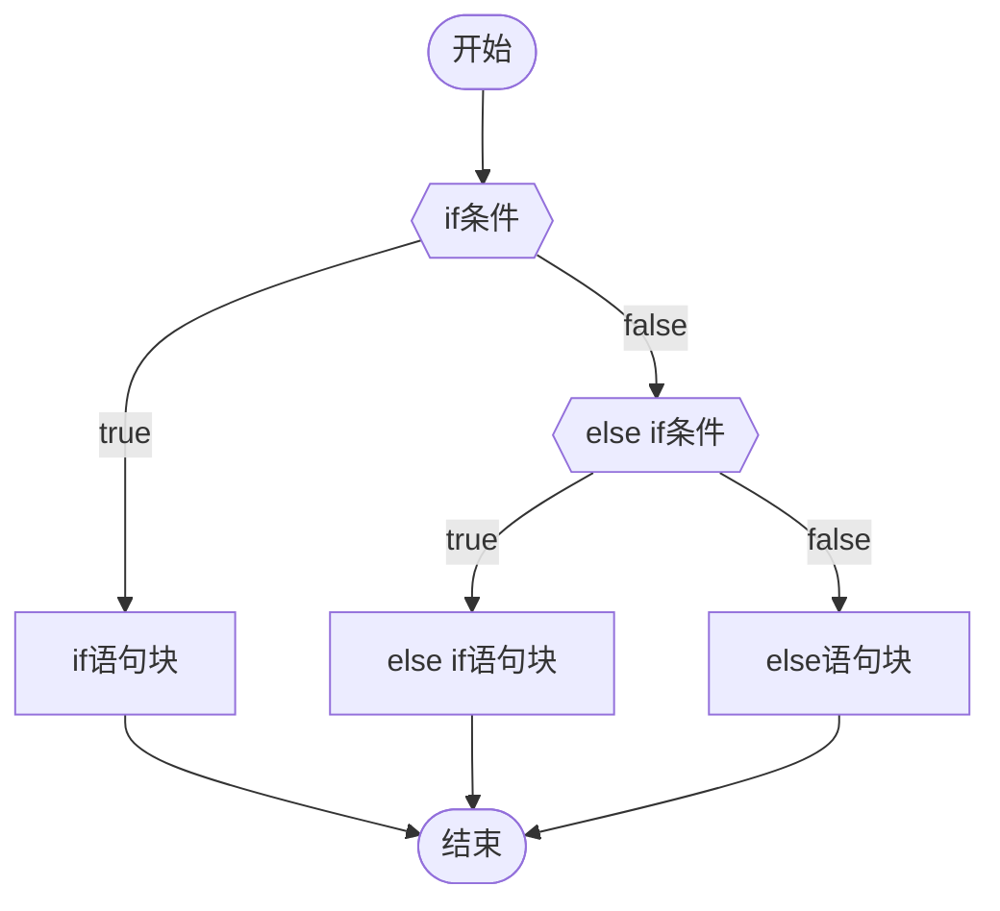

### mermaid








### 网站

<iframe width=800 height=400 src="https://www.runoob.com/html/html-tutorial.html" scrolling="auto" border="0" frameborder="no" framespacing="0" allowfullscreen="true"> </iframe> 


### 线上音频

<audio controls="controls" preload="none" src="https://www.ldoceonline.com/media/english/exaProns/p008-001803372.mp3?version=1.2.37"></audio> 


### 线上视频

<iframe width=600 height=400 src="http://player.bilibili.com/player.html?aid=20190823&;bvid=BV1yW411s7og&cid=32964980&page=1&autoplay=0" scrolling="no" border="0" frameborder="no" framespacing="0" allowfullscreen="true"> </iframe> 

 
### 日历
## 📅八月(2022)

| 周一                                    | 周二                                    | 周三                                    | 周四                                    | 周五                                    | 周六                                    | 周日                                    |
| ------------------------------------- | ------------------------------------- | ------------------------------------- | ------------------------------------- | ------------------------------------- | ------------------------------------- | ------------------------------------- |
| [[2022-08-01\|1]]<br><span>初四</span>  | [[2022-08-02\|2]]<br><span>初五</span>  | [[2022-08-03\|3]]<br><span>初六</span>  | [[2022-08-04\|4]]<br><span>初七</span>  | [[2022-08-05\|5]]<br><span>初八</span>  | [[2022-08-06\|6]]<br><span>初九</span>  | [[2022-08-07\|7]]<br><span>初十</span>  |
| [[2022-08-08\|8]]<br><span>十一</span>  | [[2022-08-09\|9]]<br><span>十二</span>  | [[2022-08-10\|10]]<br><span>十三</span> | [[2022-08-11\|11]]<br><span>十四</span> | [[2022-08-12\|12]]<br><span>十五</span> | [[2022-08-13\|13]]<br><span>十六</span> | [[2022-08-14\|14]]<br><span>十七</span> |
| [[2022-08-15\|15]]<br><span>十八</span> | [[2022-08-16\|16]]<br><span>十九</span> | [[2022-08-17\|17]]<br><span>廿十</span> | [[2022-08-18\|18]]<br><span>廿一</span> | [[2022-08-19\|19]]<br><span>廿二</span> | [[2022-08-20\|20]]<br><span>廿三</span> | [[2022-08-21\|21]]<br><span>廿四</span> |
| [[2022-08-22\|22]]<br><span>廿五</span> | [[2022-08-23\|23]]<br><span>廿六</span> | [[2022-08-24\|24]]<br><span>廿七</span> | [[2022-08-25\|25]]<br><span>廿八</span> | [[2022-08-26\|26]]<br><span>廿九</span> | [[2022-08-27\|27]]<br><span>八月</span> | [[2022-08-28\|28]]<br><span>初二</span> |
| [[2022-08-29\|29]]<br><span>初三</span> | [[2022-08-30\|30]]<br><span>初四</span> | [[2022-08-31\|31]]<br><span>初五</span> | -                                     | -                                     | -                                     | -                                     |


[](https://workflow.jace.pro/#/edit/eyJjb2RlIjoiZ3JhcGggTFIgIFxuICAgIEFb5byA5aeLXSAtLT4gQnvliKTmlq3mnaHku7Y_fSAgXG4gICAgQiAtLeaYry0tPiBDW-aJp-ihjOaTjeS9nDFdICBcbiAgICBCIC0t5ZCmLS0-IERb5omn6KGM5pON5L2cMl0gIFxuICAgIEMgLS0-IEV757un57ut5ZCXP30gIFxuICAgIEUgLS3mmK8tLT4gRlvmiafooYzmk43kvZwzXSAgXG4gICAgRSAtLeWQpi0tPiBHW-e7k-adn10gIFxuICAgIEQgLS0-IEciLCJtZXJtYWlkIjp7InRoZW1lIjoiZGVmYXVsdCJ9LCJ1cGRhdGVFZGl0b3IiOmZhbHNlfQ)

```mermaid
gantt  
dateFormat  YYYY-MM-DD  
title       软件开发计划  
section 设计  
        需求分析       :active,    a1, 2023-06-15, 3d  
        原型设计       :after a1,  a2, 2023-06-18, 5d  
section 开发  
        前端开发       :active,    d1, 2023-06-25, 5d  
        后端开发       :after d1,  d2, 2023-07-01, 5d  
section 测试  
        功能测试       :after d2,  t1, 2023-07-06, 2d  
        性能测试       :after t1,  t2, 2023-07-08, 2d
```
